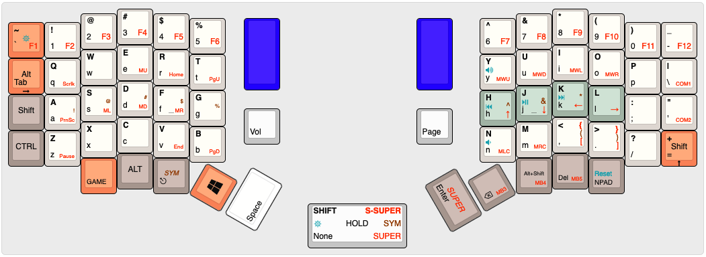
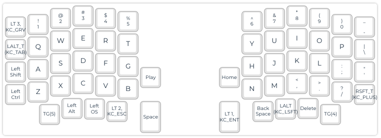
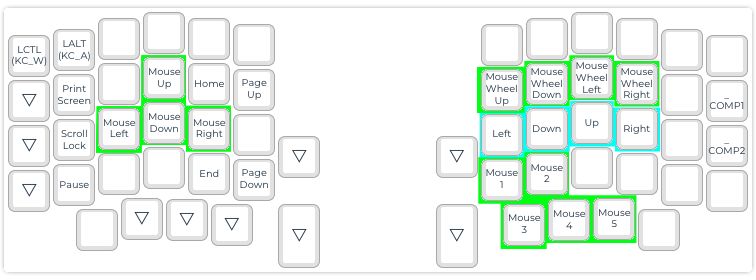
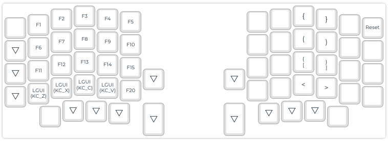
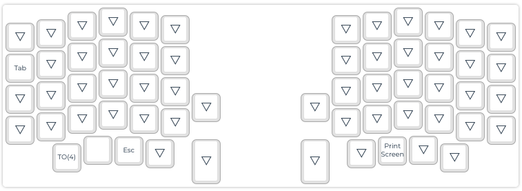
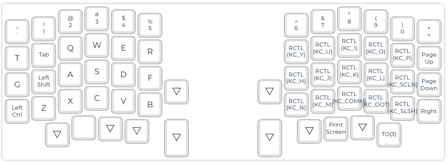

# SoFlare

This root project is primarily a top-level tracker for my research and information about the Sofle keyboard and it's ecosystem.

If you're interested in the background of my first Sofle, or the lessons learned from it, see [the post on Flare576.com](https://flare576.com/meta/hardware/electronics/sofle-v2-classic.html)

For the upgraded V2 Wireless build, see [the _other_ post on Flare576.com](https://flare576.com/meta/hardware/electronics/sofle-v2-wireless.html)

# Wireless

The ProMicro doesn't have a bluetooth chip, so it's incapable of being the main driver of a wireless build.

Most people use a [nice!Nano](https://typeractive.xyz/products/nice-nano) as their microcontroller, and most people use [ZMK](https://zmk.dev/) for the nice!Nano as opposed to QMK. I've done my best to port both the official default as well as my personal mapping to ZMK in the [submodule](https://github.com/Flare576/zmk-config).

# Key Maps

The original default keymap features an entire layer for Colemak mapping - I don't currently intend to learn a new mapping, so I decided to rethink the mapping, using [tomsaleeba/ergoslab](https://github.com/tomsaleeba/ergoslab) as inspiration:

## Layers

  
Via ([Keyboard Layout Manager](http://www.keyboard-layout-editor.com/#/gists/884e3bc833cdf80fed9337ffee93a500))

### 0 (Base)



Top-left has one Tap/Hold key for `Tab`/`Alt` (I've had my CapsLock bound to Alt for a while).

Bottom right has a `=`/`Shift` Tap/Hold.

Both `Esc` and `Enter` act as layer shifts, and there's a `Alt+Shift` key, which is my "Meta" key
for tmux/Firefox

### 1 (Mouse)



This has ended up being my most useful layer. The Green keys are a fantastic stand-in for when I
just need a quick thing done with the mouse (webpage that doesn't support
[Vimium](https://vimium.github.io/), for example), the blue keys are VIM keys for things that need
arrows.

VIM uses `CTRL+W` as a prefix for a lot of graphical operations, and tmux `ALT+A`, so throwing these
in to see how I like them on row 1.

Lastly, my KVM switch is triggered by Ctrl+Ctrl+[`1`/`2`], so the two macro keys on the right take
care of that.

### 2 (Symbols)



The original idea for this layer was inspired by [tomsaleeba/ergoslab](https://github.com/tomsaleeba/ergoslab)'s bracket layer, but my brain just couldn't get it to stick...

Until I added the bottom layer on the left. Now making Markdown links is:

```
ESC+k
Name of link
ESC+ l i v o
```
`l` puts in the ], `i` does (, `v` pastes the URL, then `o` closes the ). Magic.

The FN keys are because they didn't have anywhere else to live after the most recent redesign.

### 3 (FFXIV)



Basically disables some of the keys that are bad for gaming (Tab/Alt Tap, Esc/Sym) and adds printsc.

I could probably simplify this to a flag eventually...

### 4 (Gamez)



Ortholinear WASD is even weirder than normal, so shifting the keys to the right was a necessity.

After playing for a while, I realized shifting the top and bottom rows were unnecessary and
confusing. Additionally, the right-side is sorta a passive hotkey system; by default games don't
acknowledge the CTRL key is pressed, so the key just registers as the alpha, but if you're setting a
custom mapping, it'll see it and you'll have a new hotkey.
