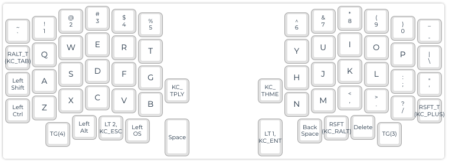

# sofle
Tracking my adventures in split-keyboard land with the Sofle V2 with design choices heavily
influenced by  [tomsaleeba/ergoslab](https://github.com/tomsaleeba/ergoslab) as well as the original
[josefadamicik/SofleKeyboard](https://github.com/josefadamcik/SofleKeyboard) projects, as well as
other layouts I find as I look around.

## Introduction

Until this project, I had never worked on a real soldering project, so there were a lot of, shall we
say, learning opportunities. Like, a whole bunch of learning opportunities.

- [Diodes Doing Wheelies](https://lh3.googleusercontent.com/pw/AM-JKLXpcnni-hIRVG0Q5W6UKhmAz4x1CDPG0np4Ru77WyS43oEeuy1Ttd_nKz7bC0hVq4CXgJr_HkjY9R8RKWADoTOu5F2XRMIq3sdYL3ckXT4LqIUmYs1ymKCOqJjRcrgjOiBuaoCyTdjfGrQuolj1mCkWaQ=w3584-h1744-no?authuser=0)
- [Desoldering Pro Micro](https://photos.google.com/share/AF1QipPytwYjRgQrpOThUrlPG6qWIp5S8OndPnbsrqexxPabXPODnWopA66ABG0FQe4cjA/photo/AF1QipNo28zbPFFA4ndrwGKWFcjzPhja6jrx9gsR8F8W?key=UEFEb0ZQUkVDN1NiWVA3SVlDRjFIbkpuM2VZZ2d3)
- ["Alternative" Removal Process](https://lh3.googleusercontent.com/pw/AM-JKLUhSb-qmn8lED717eeFKJYj9S0r9BUdeg1NvFhw69E2dNSicZ8ZmswlcJBKuunnZbi3Wz2KP7_GVmDAQKi8Xk2bwlqB44VlYtNa5t3f-Lr7UazJfQQFtU98NDDOVC8Y0D71i0ItT-2oJogBYY-mLNnnzw=w1920-h934-no?authuser=0)

Additionally, I've only ever had one mechanical keyboard, never a split keyboard... or layers, or
ortholinear, or QMK, or really even C++.

In the end, though, I'm **VERY** pleased with how things turned out!


[Key caps from kbdfans](https://kbdfans.com/products/pbt-sa-control-code-keycaps-set)

After receiving them I found that they don't have a homing mark on `F` and `J`. After looking
around I found two options: [Ball Bearing Mods](https://blog.techotom.com/post/2018-02-03-ball-bearing-homing-bumps-on-keycaps/) (which seem
like an awesome-but-more-destructive-than-I-want for these caps) and [Just use a piece of tape](https://superuser.com/questions/212968/what-is-the-best-way-to-create-tactile-bumps-on-your-keyboardv).

I started with the tape, but it came off because I slide my fingers when gaming. For right now I'm
going without homing indicators, which is working because each side has sort of a natural centering
feel with the horizontal key count and dials.

## Key learnings

Before we really dive into my build and I bore you to death with _"mah layouts, let me show you
themz"_, here are some things I learned that might actually help you:

1. International orders take a long time. My order took about a month from Vietnam.
1. The official [Build Guide](https://josefadamcik.github.io/SofleKeyboard/build_guide.html) is great
1. Soldering
    - SOCKET YOUR MCUs, but double-check your pin types:
      - All of the low-profile pins I found were round; you will need both male and female round pins.
      - Round pins and Square pins are not compatible
      - "Pitch" Refers to the distance between pins; you NEED 2.54mm. Do not buy 2.00mm.
    - [Solder matters](https://www.amazon.com/Kester-24-6337-0027-Solder-Alloy-Diameter/dp/B0149K4JTY/). Junk solder will leave your welds sharp, making it hard to clean flux residue
    - Avoid melting your board by staying around 600°F
    - The yellowish junk on your board is flux residue, and you can clean it with rubbing alcohol; you probably didn't melt your board
    - Don't be afraid to hold the iron to the PCB solder points for a bit; once they get hot enough the solder will literally flow from your iron into the joint
    - If the solder flows, but still makes a ball, you need more flux. I started with [Pen flux](https://www.amazon.com/gp/product/B07B53LNGX/ref=ppx_yo_dt_b_asin_title_o05_s00?ie=UTF8&psc=1), but save yourself time and order some [Paste Flux](https://www.amazon.com/gp/product/B008ZIV85A/ref=ppx_yo_dt_b_asin_title_o02_s01?ie=UTF8&psc=1), the pen is for when you know what you're doing
    - You'll make crappy welds when you start, and quickly get better and be tempted to go back and "fix" them. **Don't**. Finish all the way through, then go back and check - _When you think you've got enough practice, do 50% more practice._
1. Desoldering
    - Don't mess up, desoldering sucks
    - If you can afford it, get a [Desoldering Iron](https://www.amazon.com/dp/B008DJRYIG/?coliid=IQUL97ASV33ZV&colid=Q1IVZF7EQCE6&psc=1&ref_=lv_ov_lig_dp_it)
    - If you can't afford it... Find a way to. These next steps suck worse than eating ramen for a few
        weeks:
      - Set your iron to ~700°F to start (if you can adjust the temp)
      - Use desoldering wick
      - Always use the tip of the wick to start; if a lot is coming off the joint, try to move up the wick
      - Dip the tip of the wick into your flux paste. It'll make a mess on the board, but it will help attract the solder
      - Trim it between uses
      - Remove as much solder as you can. Ideally, the pins/parts just fall off
      - If all else fails, try to clip the pins to isolate them.
      - **NEVER FORCE A PIN THROUGH**: If it doesn't slip through easily, trim the wick and try again. Forcing a pin can rip out the contacts from the board - iz bad
1. Firmware
    - [The ProMicro has a custom coded reset button](https://learn.sparkfun.com/tutorials/pro-micro--fio-v3-hookup-guide#ts-reset)
    - [You can't flash both halves at the same time](https://www.reddit.com/r/olkb/comments/opkt94/questions_on_firmware_flashing_with_my_guess_at/)

## Switches


All switches are no-tactile/no-clicky with silver being 45g, black 60g, and yellow 75g.  The one
black switch on the far right was due to reaching for `-/_` triggering `\/|` too frequently. It's
been working out well so far!

## Layers

### 0 (Base)



Top-left has two Tap/Hold keys, one for `~`/`MEDIA` and under it `Tab`/`Alt` (I've had my CapsLock
bound to Alt for a while).

Bottom right has a `=`/`Shift` Tap/Hold.

Only slightly-odd key on the bottom is the `Alt+Shift` key, which is my "Meta" key for tmux/Firefox

### 1 (Mouse)


This has ended up being my most useful layer. The Green keys are a fantastic stand-in for when I
just need a quick thing done with the mouse (webpage that doesn't support
[Vimium](https://vimium.github.io/), for example), the blue keys are VIM keys for things that need
arrows.

VIM uses `CTRL+W` as a prefix for a lot of graphical operations, and tmux `ALT+A`, so throwing these
in to see how I like them on row 1.

Lastly, my KVM switch is triggered by Ctrl+Ctrl+[`1`/`2`], so the two macro keys on the right take
care of that.

### 2 (Symbols)


The original idea for this layer was inspired by [tomsaleeba/ergoslab](https://github.com/tomsaleeba/ergoslab)'s bracket layer, but my brain just couldn't get it to stick...

Until I added the bottom layer on the left. Now making Markdown links is:

```
ESC+k
Name of link
ESC+ l i v o
```
`l` puts in the ], `i` does (, `v` pastes the URL, then `o` closes the ). Magic.

The FN keys are because they didn't have anywhere else to live after the most recent redesign.

### 3 (FFXIV)


Basically disables some of the keys that are bad for gaming (Tab/Alt Tap, Esc/Sym) and adds printsc.

I could probably simplify this to a flag eventually...

### 4 (Gamez)


Ortholinear WASD is even weirder than normal, so shifting the keys to the right was a necessity.

After playing for a while, I realized shifting the top and bottom rows were unnecessary and
confusing. Additionally, the left-side is sorta a passive hotkey system; by default games don't
acknowledge the CTRL key is pressed, so the key just registers as the alpha, but if you're setting a
custom mapping, it'll see it and you'll have a new hotkey.

## Observations

### Hurdles

I learned to type wrong, I think. I frequently used my right index finger to press `b`, but with the
sofle that'd be quite a reach :)

That's a pretty small issue, though, when compared to the fact that I've ALWAYS used my left pointer
finger to push `c`. This dramatically throws off `c`, `v`, and `b` in an Ortho layout. That'll be
the largest learning curve in this process.

Other complications are remembering that my left thumb can't hit `space` (resulting in a lot of
prematurely sent messages), and attempting to hit the old locations for `ESC` and `BACKSPACE`.

### Victories

The biggest wins so far are mostly on the **MOUSE** layer, which is a bit surprising considering how
busy that layer ended up being. Controlling the mouse with `WASD`-type controls (`ESDF`,
technically) is incredibly useful, and having `HJKL` as arrow keys is everything I'd hoped it would
be.

Also, flashing the firmware quickly means that I don't ingrain any bad habits by using the wrong
keys for too long. I do wish I could flash both keyboards without having to play musical chairs with
cords, but ¯\\_(ツ)\_\/¯.

And good goat do my back and neck feel better already. Like, **__WAY__** better.

// Dev note: regex for firmware->configurator:'<,'>s%\v([^, ]+)%"\1"%g
